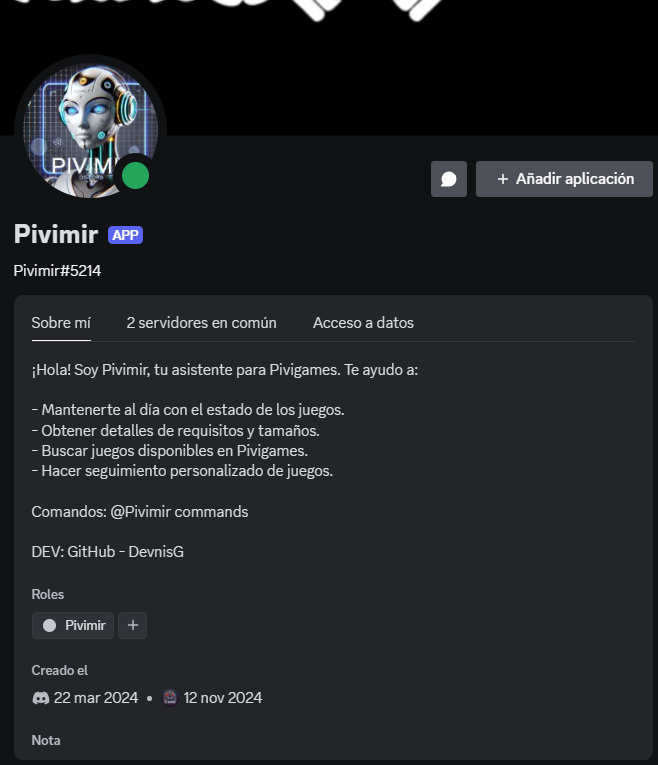
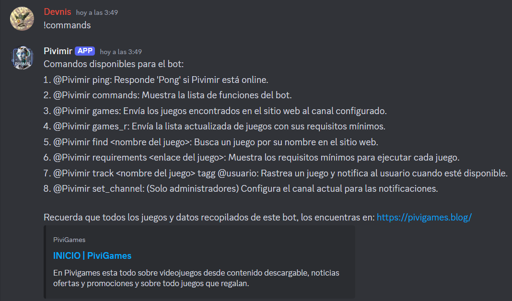
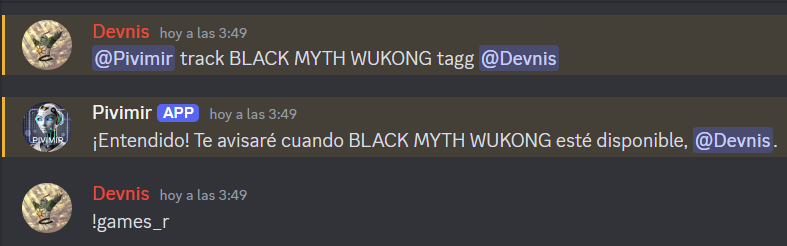
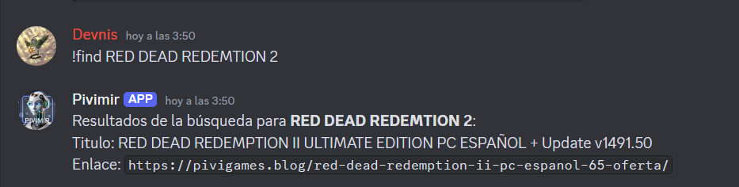
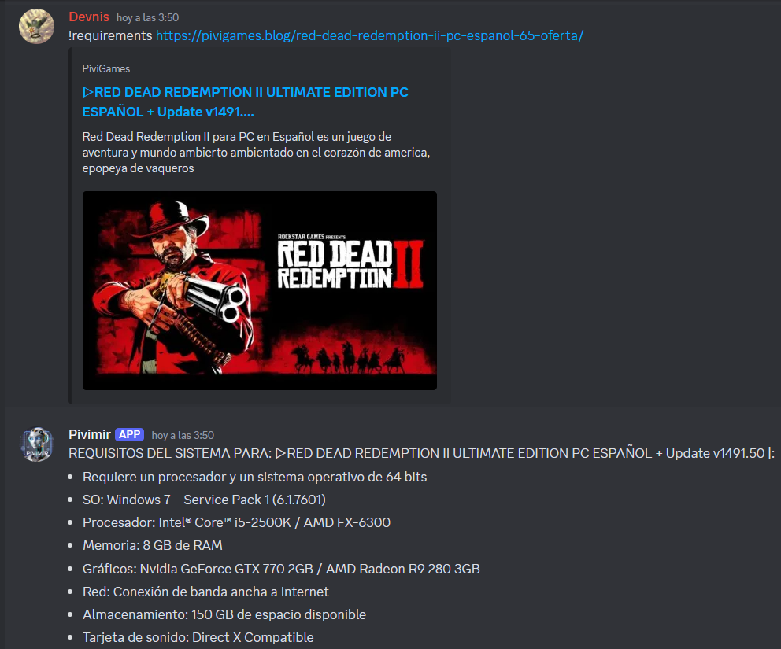
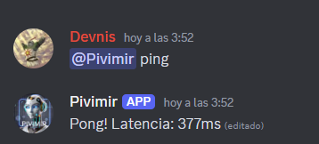

**Pivimir Bot**

_Pivimir es un bot de Discord diseñado para interactuar con el sitio web PiviGames, permitiendo a los usuarios buscar, rastrear y obtener información sobre juegos de PC directamente desde su servidor de Discord._

**¿Qué es Pivimir y para qué sirve?**

- Buscar juegos disponibles en PiviGames y mostrar detalles como título, enlace y peso del juego.
- Obtener requisitos del sistema para juegos específicos.
- Rastrear juegos y notificar a los usuarios cuando un juego específico esté disponible.
- Listar juegos recientes y mantener a los usuarios actualizados con las últimas novedades.
- Interacción amigable mediante comandos sencillos y respuestas rápidas.
- Es una herramienta útil para comunidades de jugadores que desean mantenerse informadas sobre nuevos lanzamientos y actualizaciones sin salir de Discord.

**Características principales:**

- Comandos personalizados: Una variedad de comandos para interactuar con el bot y obtener información relevante.
- Notificaciones automatizadas: Rastrea juegos específicos y notifica a los usuarios cuando están disponibles.
- Búsqueda avanzada: Permite buscar juegos por nombre y obtener resultados detallados.
- Información detallada: Proporciona detalles como peso del juego y requisitos del sistema.
- Fácil configuración: Los administradores pueden configurar el canal de interacción con un simple comando.

**¿Cómo se utiliza?**

_Añadir el bot a tu servidor de Discord: Invita a Pivimir utilizando el siguiente enlace:_
`https://discord.com/oauth2/authorize?client_id=1220653934314655795`

_Configurar el canal: Un administrador debe establecer el canal donde el bot interactuará usando el comando:_

`@Pivimir set_channel`

**Comandos disponibles**

_- Ping: Verifica la latencia del bot._

**Comando:** `@Pivimir ping`

_- Lista de comandos: Muestra todos los comandos disponibles._

**Comando:** `@Pivimir commands`

_- Mostrar juegos recientes: Muestra los juegos más recientes disponibles en PiviGames._

**Comando:** `@Pivimir games`

_- Mostrar juegos con requisitos: Lista los juegos recientes junto con sus requisitos mínimos._

**Comando:** `@Pivimir games_r`

_- Buscar un juego específico: Busca un juego por nombre y muestra los resultados._

**Comando:** `@Pivimir find <nombre del juego>`

_- Obtener requisitos de un juego: Muestra los requisitos mínimos de un juego específico usando su enlace._

**Comando:** `@Pivimir requirements <enlace del juego>`

_- Rastrear un juego: El bot notificará al usuario cuando el juego especificado esté disponible._

**Comando:** `@Pivimir track <nombre del juego> tagg @usuario`

**Ejemplos de uso**

_Buscar un juego llamado **"Minecraft"**:_

**Comando:** `@Pivimir find Minecraft`

_Rastrear el juego "God of War" y etiquetar al usuario @PlayerOne:_

**Comando:** `@Pivimir track God of War tagg @PlayerOne`

_Obtener los requisitos del sistema para un juego específico:_

**Comando:** `@Pivimir requirements https://pivigames.blog/enlace-del-juego`

**Instalación y despliegue**

_Requisitos previos:_

- Python 3.11 o superior
- Dependencias: Listadas en requirements.txt

NOTA: Necesitas un token de bot de Discord para ejecutar Pivimir o Utilizar la app desde el enlace proporcionado.

**Pasos para ejecutar el bot localmente:**
- `git clone https://github.com/DevnisG/Pivimir-Bot.git`

- `cd pivimir-bot`

- `pip install -r requirements.txt`

- `python main.py`

**Contacto**

_Desarrollado por @Devnis. Para preguntas o soporte, puedes contactarme a través de:_

_Correo electrónico:_ denis.gontero.2000@gmail.com

